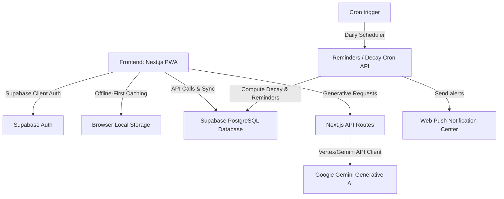

# HumanOS — Technical Documentation

This document outlines the core architecture, data schemas, caching models, and API routing systems used in the HumanOS Personal Relationship Intelligence System.

---

## 1. System Architecture Overview

HumanOS is a modern Next.js 15 (App Router) React application powered by Supabase for database operations, user authentication, and edge functions. The platform is designed to run offline-first, leveraging client-side browser caches for critical paths.

---

## 2. Database Models & Schema Design

All tables are defined in [supabase/schema.sql](file:///c:/Users/PAAPA/Desktop/lifeOs/supabase/schema.sql) and utilize PostgreSQL. Row Level Security (RLS) is active to restrict read/write queries to authenticated owners.

### 2.1. `people` Table
Stores contact profiles.
- `id` (UUID, Primary Key)
- `user_id` (UUID, Foreign Key $\rightarrow$ `auth.users`)
- `name` (TEXT)
- `birthday` (DATE, Nullable)
- `photo` (TEXT, Nullable, public bucket url)
- `relationship_type` (TEXT) — Normalized casing and aliases are resolved dynamically in analytics.
- `pronouns` (TEXT, default: 'Rather not say')
- `strength_score` (INT, 0-100, default: 50) — Used for node scaling in network graph.
- `trust_score` (INT, 0-100, default: 50)
- `is_archived` (BOOLEAN, default: false)
- `status` (TEXT, Nullable) — Marks special states like `pending_verification` for imported lists.
- `created_at` (TIMESTAMP)

### 2.2. `person_phones` Table
One-to-many phone number storage linked to a specific person.
- `id` (UUID, Primary Key)
- `person_id` (UUID, Foreign Key $\rightarrow$ `people.id` ON DELETE CASCADE)
- `phone` (TEXT)
- `label` (TEXT, e.g., 'Mobile', 'Home', 'Work', 'Primary')
- `created_at` (TIMESTAMP)

*Fallback Logic:* The primary contact list will look for numbers in this table first. For backward compatibility, the parent contact record is updated or read if no records are found in `person_phones`.

### 2.3. `interactions` Table
Timeline journal logging logs of past communications.
- `id` (UUID, Primary Key)
- `person_id` (UUID, Foreign Key $\rightarrow$ `people.id` ON DELETE CASCADE)
- `user_id` (UUID, Foreign Key $\rightarrow$ `auth.users`)
- `type` (TEXT, e.g., 'chat', 'call', 'meeting', 'gift', 'conflict')
- `interaction_date` (DATE)
- `notes` (TEXT, Nullable)
- `mood` (TEXT, Nullable)
- `created_at` (TIMESTAMP)

### 2.4. `reminders` Table
Tracks birthdays and custom interaction reminders.
- `id` (UUID, Primary Key)
- `person_id` (UUID, Foreign Key $\rightarrow$ `people.id` ON DELETE CASCADE)
- `user_id` (UUID, Foreign Key $\rightarrow$ `auth.users`)
- `title` (TEXT)
- `scheduled_for` (DATE)
- `is_completed` (BOOLEAN, default: false)
- `created_at` (TIMESTAMP)

---

## 3. Caching & Storage Strategy

### 3.1. Local Cache Layers
To enable instant load times and partial offline capability, HumanOS captures state from API calls and serializes them to client-side localStorage under the following keys:
- `lifeos_people_cache`: Active contact library array.
- `lifeos_graph_cache`: Pre-calculated D3 Nodes and Links arrays for the network graph.
- `lifeos_analytics_people` / `lifeos_analytics_interactions`: Local tables matching data models needed for recharts.
- `lifeos_person_cache_[id]`: Individual profiles with timeline details and tags.

When navigating, the page displays the cached data first (if it exists) for instant visual load, and triggers an asynchronous refresh fetch to Supabase. If the fresh data differs, it overrides local state and refreshes the view.

### 3.2. HTML5 Storage Quota Estimation
To keep track of storage status and maintain trust:
- Utilizes the `navigator.storage.estimate()` API.
- Computes `usage` and `quota` values dynamically inside a settings hook.
- Shows total bytes, percentage used, and cache sizes in Settings.
- Offers an interactive reset trigger to flush the cache.

---

## 4. Server API Architecture

All server API handlers are implemented in Next.js edge route handlers:

### 4.1. Generative AI Engine (`/api/ai`)
Accepts requests from connection profile panels to execute custom prompt builders using Gemini:
- **Birthday Messages (`type: 'message'`)**: Analyzes the contact's personality notes and hobbies to write a warm, custom birthday greeting.
- **Gift Recommendations (`type: 'gift'`)**: Generates 5 personalized physical or experience gift ideas with explanation notes.
- **Conflict Resolution (`type: 'conflict'`)**: Reads tension history tags and offers communication strategies.
- **Mini appreciation websites (`type: 'website'`)**: Generates raw HTML/CSS strings styling a custom cyberpunk/glassmorphic page for the contact.

### 4.2. Automation Cron (`/api/cron/reminders`)
Triggered daily via an external cron scheduler.
1. **Birthday Alerts**: Scans birthdays and creates in-app notification triggers at intervals of 7, 3, and 1 days before, plus day-of.
2. **Custom Reminders**: Generates alert entries for custom tasks scheduled in the timeline.
3. **Decay Reminders**: Scans active connections and compares the latest interaction date against decay thresholds:
   - *Family / Mum / Dad / Close Friends*: 7 Days threshold.
   - *Friends / Coworkers*: 14 Days threshold.
   - *Acquaintances / Classmates*: 30 Days threshold.
   - Triggers an automatic decay warning notification if a connection has drifted beyond its target threshold.
